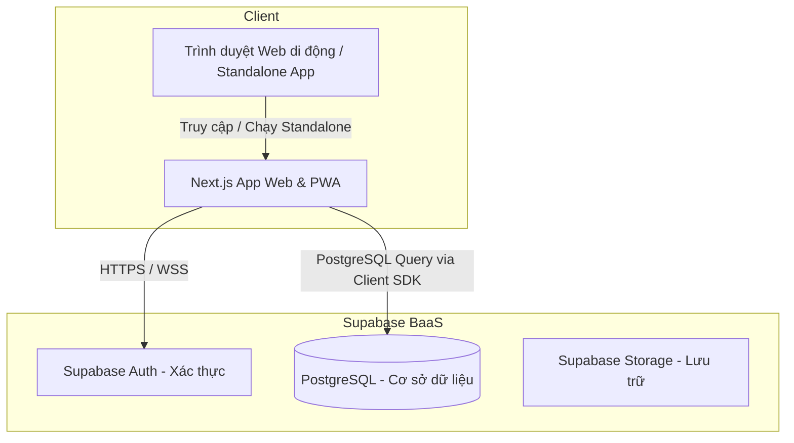
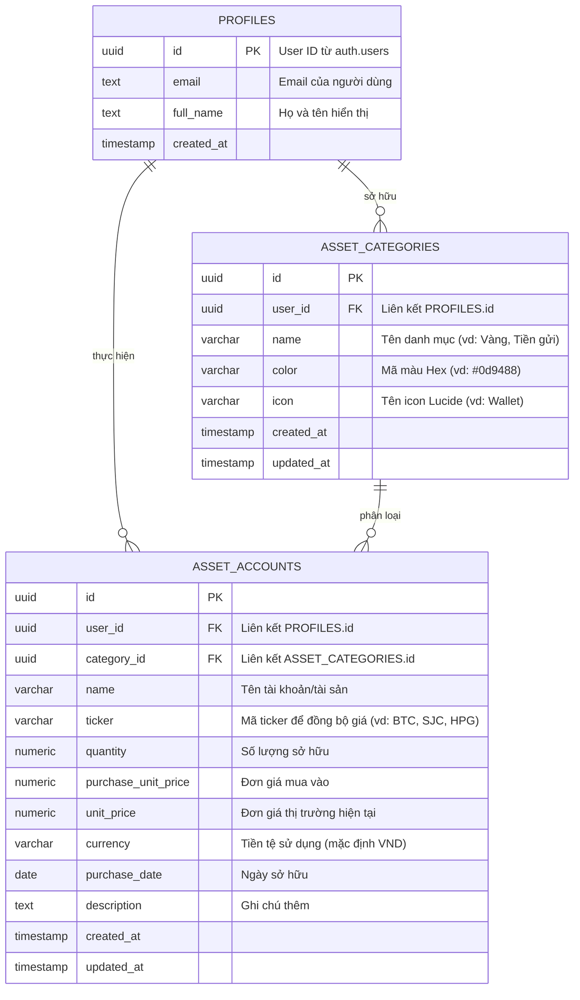

# Personal Finance Application (Next.js + Supabase PWA)

Chào mừng bạn đến với dự án **Personal Finance**! Đây là tài liệu hướng dẫn tổng quan về kiến trúc hệ thống, sơ đồ cơ sở dữ liệu (Database Schema), hướng dẫn thiết lập **PWA (Progressive Web App)** giúp ứng dụng chạy mượt mà và có thể cài đặt độc lập trên thiết bị di động (iOS & Android), cấu trúc thư mục thực tế của dự án và các bước thiết lập môi trường phát triển.

---

## 1. Kiến trúc Hệ thống Tổng quan

Dự án được xây dựng theo mô hình **Web-Only** nhưng được tối ưu hóa toàn diện cho **Mobile-First** và tích hợp các tiêu chuẩn **PWA**. Người dùng có thể truy cập qua trình duyệt Web hoặc "Cài đặt" ứng dụng trực tiếp lên màn hình chính (Home Screen) của điện thoại di động mà không cần thông qua App Store hay Google Play Store.



### Ưu điểm của giải pháp Web-Only + PWA:
1. **Phát triển nhanh chóng**: Codebase chạy trực tiếp tại root của dự án, sử dụng Next.js App Router (RSC + Server Actions) cho cả giao diện desktop lẫn mobile.
2. **Cài đặt như App Native**: Hỗ trợ đầy đủ manifest và cài đặt standalone trên Safari (iOS) hay Chrome (Android), ẩn thanh địa chỉ và có màn hình splash screen riêng.
3. **Supabase PostgreSQL**: Đảm bảo cấu trúc dữ liệu tài chính chặt chẽ bằng cơ sở dữ liệu quan hệ SQL và đồng bộ trạng thái thực tế giữa các thiết bị thông qua các Server Action & Client Revalidation.

---

## 2. Thiết kế Cơ sở dữ liệu (Database Schema)

Dưới đây là sơ đồ thực thể mối quan hệ (ERD) mô tả chính xác cấu trúc cơ sở dữ liệu thực tế đang chạy trên Supabase của dự án.

### Sơ đồ Thực thể (ERD)



### Script Khởi tạo SQL (Chạy trên Supabase SQL Editor)

Để đồng bộ cấu trúc cơ sở dữ liệu lên Supabase Project mới, hãy copy đoạn script sau và chạy trực tiếp trong mục **SQL Editor** trên Supabase Dashboard:

```sql
-- 1. Hàm tự động cập nhật thời gian thay đổi (updated_at)
CREATE OR REPLACE FUNCTION update_updated_at_column()
RETURNS TRIGGER AS $$
BEGIN
    NEW.updated_at = now();
    RETURN NEW;
END;
$$ language plpgsql;

-- 2. Tạo bảng Profiles (Đồng bộ thông tin từ auth.users của Supabase)
CREATE TABLE public.profiles (
  id UUID REFERENCES auth.users(id) ON DELETE CASCADE PRIMARY KEY,
  email TEXT UNIQUE NOT NULL,
  full_name TEXT,
  created_at TIMESTAMPTZ DEFAULT now() NOT NULL
);

-- Trigger tự động tạo profile khi đăng ký tài khoản thành công
CREATE OR REPLACE FUNCTION public.handle_new_user()
RETURNS TRIGGER AS $$
BEGIN
  INSERT INTO public.profiles (id, email, full_name)
  VALUES (
    NEW.id,
    NEW.email,
    NEW.raw_user_meta_data->>'full_name'
  );
  RETURN NEW;
END;
$$ LANGUAGE plpgsql SECURITY DEFINER;

CREATE OR REPLACE TRIGGER on_auth_user_created
  AFTER INSERT ON auth.users
  FOR EACH ROW EXECUTE PROCEDURE public.handle_new_user();

-- 3. Tạo bảng Asset Categories (Danh mục tài sản tùy chỉnh)
CREATE TABLE public.asset_categories (
    id UUID PRIMARY KEY DEFAULT gen_random_uuid(),
    user_id UUID NOT NULL REFERENCES public.profiles(id) ON DELETE CASCADE,
    name VARCHAR(100) NOT NULL,
    color VARCHAR(7) NOT NULL, -- Định dạng mã màu Hex, vd: '#7c3aed'
    icon VARCHAR(50) NOT NULL,  -- Tên component icon từ Lucide, vd: 'Wallet'
    created_at TIMESTAMPTZ DEFAULT now() NOT NULL,
    updated_at TIMESTAMPTZ DEFAULT now() NOT NULL,
    UNIQUE(user_id, name)
);

CREATE OR REPLACE TRIGGER update_asset_categories_updated_at
    BEFORE UPDATE ON public.asset_categories
    FOR EACH ROW EXECUTE FUNCTION update_updated_at_column();

-- 4. Tạo bảng Asset Accounts (Tài sản / Giao dịch thu chi)
CREATE TABLE public.asset_accounts (
    id UUID PRIMARY KEY DEFAULT gen_random_uuid(),
    user_id UUID NOT NULL REFERENCES public.profiles(id) ON DELETE CASCADE,
    category_id UUID NOT NULL REFERENCES public.asset_categories(id) ON DELETE CASCADE,
    name VARCHAR(100) NOT NULL,
    ticker VARCHAR(20), -- Ví dụ: 'BTC', 'SJC', 'HPG' cho mục đích tự động lấy giá thị trường
    quantity NUMERIC NOT NULL DEFAULT 0,
    purchase_unit_price NUMERIC NOT NULL DEFAULT 0,
    unit_price NUMERIC NOT NULL DEFAULT 0,
    currency VARCHAR(10) NOT NULL DEFAULT 'VND',
    purchase_date DATE NOT NULL DEFAULT CURRENT_DATE,
    description TEXT,
    created_at TIMESTAMPTZ DEFAULT now() NOT NULL,
    updated_at TIMESTAMPTZ DEFAULT now() NOT NULL
);

CREATE OR REPLACE TRIGGER update_asset_accounts_updated_at
    BEFORE UPDATE ON public.asset_accounts
    FOR EACH ROW EXECUTE FUNCTION update_updated_at_column();

-- =========================================================================
-- BẢO MẬT: KÍCH HOẠT ROW LEVEL SECURITY (RLS)
-- =========================================================================
ALTER TABLE public.profiles ENABLE ROW LEVEL SECURITY;
ALTER TABLE public.asset_categories ENABLE ROW LEVEL SECURITY;
ALTER TABLE public.asset_accounts ENABLE ROW LEVEL SECURITY;

-- Chính sách bảo mật cho Profiles
CREATE POLICY "Users can view their own profile" ON public.profiles
  FOR SELECT USING (auth.uid() = id);

CREATE POLICY "Users can update their own profile" ON public.profiles
  FOR UPDATE USING (auth.uid() = id);

-- Chính sách bảo mật cho Asset Categories
CREATE POLICY "Users can manage their own asset categories" ON public.asset_categories
  FOR ALL USING (auth.uid() = user_id);

-- Chính sách bảo mật cho Asset Accounts
CREATE POLICY "Users can manage their own asset accounts" ON public.asset_accounts
  FOR ALL USING (auth.uid() = user_id);
```

---

## 3. Hướng dẫn Thiết lập PWA (Progressive Web App) trong Next.js

Để ứng dụng có thể cài đặt trực tiếp trên màn hình Home Screen của di động và chạy độc lập:

### A. Định nghĩa file Manifest
File Manifest được quản lý trong dự án dưới đường dẫn `public/manifest.json` nhằm định nghĩa các cài đặt cho PWA:

```json
{
  "name": "Personal Finance Tracker",
  "short_name": "Finance",
  "description": "Ứng dụng quản lý tài chính cá nhân thông minh",
  "start_url": "/dashboard",
  "display": "standalone",
  "background_color": "#09090b",
  "theme_color": "#09090b",
  "orientation": "portrait",
  "icons": [
    {
      "src": "/icons/icon-192x192.png",
      "sizes": "192x192",
      "type": "image/png",
      "purpose": "any maskable"
    },
    {
      "src": "/icons/icon-512x512.png",
      "sizes": "512x512",
      "type": "image/png",
      "purpose": "any maskable"
    }
  ]
}
```

### B. Cấu hình Meta Tags & Viewport
Trong file `src/app/layout.tsx`, siêu dữ liệu (Metadata) và cấu hình khung nhìn (Viewport) được thiết lập để tối ưu hóa hiển thị di động:

```typescript
import type { Metadata, Viewport } from "next";

export const metadata: Metadata = {
  title: "Personal Finance",
  description: "Quản lý tài chính cá nhân thông minh",
  manifest: "/manifest.json",
  appleWebApp: {
    capable: true,
    statusBarStyle: "black-translucent",
    title: "Finance",
  },
};

export const viewport: Viewport = {
  themeColor: "#09090b",
  width: "device-width",
  initialScale: 1,
  maximumScale: 1,
  userScalable: false, // Ngăn zoom ngoài ý muốn trên Mobile để tạo cảm giác giống Native App
};
```

---

## 4. Các Tính năng Nổi bật trong Dự án

1. **Giao diện Glassmorphism Cao cấp**: Sử dụng Tailwind CSS v4 kết hợp hiệu ứng mờ kính (`backdrop-blur`), viền bán trong suốt và các gam màu hài hòa, mang lại trải nghiệm thị giác sống động cả ở chế độ sáng lẫn tối.
2. **Thanh Điều hướng Thu gọn (Collapsible Sidebar)**: Sidebar ở chế độ thu gọn sẽ chỉ hiển thị các icon căn giữa cùng tooltip tương ứng, giúp mở rộng tối đa diện tích hiển thị của trang chính.
3. **Danh mục tùy chỉnh (`/dashboard/categories`)**: Cung cấp một trang quản lý riêng biệt để thực hiện CRUD các danh mục tài sản đi kèm hệ thống màu sắc và icon tuyển chọn.
4. **Bảng Lịch sử Giao dịch Dạng Dòng**: Thay thế lưới thẻ bằng bảng HTML hiển thị chi tiết (Tài sản, Danh mục, Ngày mua, Số lượng, Giá mua, Giá hiện tại, Lời/Lỗ, Tổng giá trị). Tự động hiển thị chỉ số Lời/Lỗ theo % và số tiền (màu xanh cho lời, đỏ cho lỗ).
5. **Đồng bộ giá thị trường tự động**: Tích hợp các service API ngoài để lấy giá tài sản thực tế theo thời gian thực (giá vàng SJC/DOJI qua Vang.Today, crypto qua Binance, và cổ phiếu qua Yahoo Finance).
6. **Biểu đồ Phân bổ Tròn (Donut Chart)**: Biểu đồ SVG donut tự thiết kế biểu diễn trực quan tỉ lệ phân bổ giá trị ròng theo từng danh mục kèm tương tác khi di chuột.
7. **Hộp thoại Xác nhận (Confirmation Modals)**: Sử dụng các popup glassmorphism tùy biến để yêu cầu xác nhận trước khi thực hiện các tác vụ nguy hiểm (như Xóa tài sản, Xóa danh mục hoặc Đăng xuất).

---

## 5. Cấu trúc Thư mục Thực tế của Dự án

Dưới đây là sơ đồ tổ chức mã nguồn tại root directory của dự án:

```text
Personal-finance/
├── public/                       # File tĩnh công khai (manifest.json, icons, favicon)
├── src/
│   ├── app/                      # Next.js App Router (Layouts, Pages, Server Actions)
│   │   ├── (auth)/               # Đăng ký, đăng nhập
│   │   ├── dashboard/            # Tổng quan Dashboard và các trang chức năng
│   │   │   ├── assets/           # Trang quản lý Lịch sử Giao dịch
│   │   │   ├── categories/       # Trang quản lý Danh mục Tài sản
│   │   │   ├── layout.tsx        # Cấu hình khung nhìn và menu sidebar điều hướng
│   │   │   └── page.tsx          # Giao diện Tổng quan
│   │   ├── layout.tsx            # Root layout chứa Providers và Cấu hình PWA
│   │   └── page.tsx              # Landing page / Redirect logic
│   ├── components/               # UI Components tái sử dụng
│   │   ├── ui/                   # Các component giao diện (Modal, Chart, v.v.)
│   │   └── providers.tsx         # Context providers (Theme, Internationalization)
│   └── lib/                      # Các logic xử lý cốt lõi
│       ├── services/             # API kết nối ngoài (vd: market-prices.ts đồng bộ giá)
│       ├── supabase/             # Cấu hình Supabase client & server instances
│       └── types/                # Các kiểu dữ liệu TypeScript (assets.ts)
├── specs/                        # File đặc tả thiết kế và checklist của các tính năng
├── supabase/                     # Các file migration của CSDL PostgreSQL
├── package.json                  # Dependencies và scripts
├── tsconfig.json                 # Cấu hình TypeScript
└── postcss.config.mjs            # Cấu hình PostCSS cho Tailwind CSS v4
```

---

## 6. Hướng dẫn Khởi chạy Dự án Dưới local

### Bước 1: Sao chép dự án & cài đặt thư viện
Tại thư mục gốc của dự án `Personal-finance`, thực hiện cài đặt các dependencies:
```bash
npm install
```

### Bước 2: Thiết lập biến môi trường
Tạo file `.env.local` tại thư mục gốc và cung cấp thông tin kết nối Supabase của bạn (có thể tham khảo từ `.env.example`):
```env
NEXT_PUBLIC_SUPABASE_URL=YOUR_SUPABASE_URL
NEXT_PUBLIC_SUPABASE_ANON_KEY=YOUR_SUPABASE_ANON_KEY
```

### Bước 3: Khởi chạy development server
Chạy lệnh sau để bắt đầu phát triển:
```bash
npm run dev
```
Truy cập ứng dụng thông qua địa chỉ mặc định [http://localhost:3000](http://localhost:3000).

### Bước 4: Kiểm tra và Build dự án
Trước khi deploy hoặc commit, bạn có thể build dự án để chắc chắn không xảy ra lỗi build hay TypeScript error:
```bash
npm run build
```
