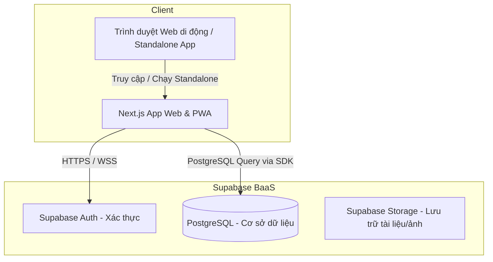
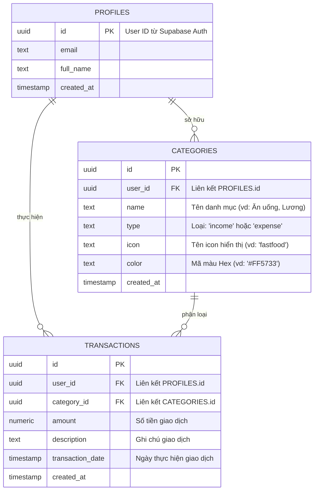

# Personal Finance Application Roadmap & Database Design (Web-Only + PWA)

Chào mừng bạn đến với dự án **Personal Finance**! Đây là tài liệu hướng dẫn tổng quan về kiến trúc hệ thống, sơ đồ cơ sở dữ liệu (Database Schema), hướng dẫn thiết lập **PWA (Progressive Web App)** giúp ứng dụng Web chạy mượt mà và có thể cài đặt như ứng dụng Native trên thiết bị di động (iOS & Android), cấu trúc thư mục gợi ý và các bước tiếp theo để bắt đầu.

---

## 1. Kiến trúc Hệ thống Tổng quan

Dự án chuyển sang mô hình **Web-Only** nhưng được thiết kế theo hướng **Mobile-First** và tích hợp **PWA**. Người dùng có thể truy cập qua trình duyệt Web trên máy tính, điện thoại hoặc "Cài đặt" ứng dụng trực tiếp lên màn hình chính (Home Screen) của điện thoại di động mà không cần thông qua App Store hay Google Play Store.



### Ưu điểm của giải pháp Web-Only + PWA:
1. **Phát triển nhanh chóng**: Chỉ cần viết code một lần (Next.js) là có thể chạy được trên cả máy tính, máy tính bảng và điện thoại.
2. **Cài đặt như App Native**: Nhờ công nghệ PWA, người dùng có thể bấm "Add to Home Screen" trên Safari (iOS) hoặc Chrome (Android) để cài đặt ứng dụng. Ứng dụng sẽ chạy không có thanh địa chỉ trình duyệt, có icon riêng và màn hình khởi động (Splash Screen).
3. **Supabase PostgreSQL**: Đảm bảo cấu trúc dữ liệu tài chính (giao dịch, danh mục, ví) chặt chẽ bằng CSDL quan hệ SQL, đồng bộ real-time giữa các tab trình duyệt và thiết bị của cùng một tài khoản.

---

## 2. Thiết kế Cơ sở dữ liệu (Database Schema)

Dưới đây là sơ đồ cơ sở dữ liệu quan hệ cho tính năng **Quản lý thu chi cơ bản** (Giao dịch & Danh mục).

### Sơ đồ Thực thể (ERD)



### Script Khởi tạo SQL (Chạy trên Supabase SQL Editor)

Bạn hãy copy đoạn script sau và chạy trực tiếp trong mục **SQL Editor** trên Supabase Dashboard để tạo các bảng, trigger tự động cập nhật profile và cấu hình chính sách bảo mật RLS.

```sql
-- 1. Tạo bảng Profiles (Tự động liên kết với bảng auth.users của Supabase)
create table public.profiles (
  id uuid references auth.users on delete cascade primary key,
  email text unique,
  full_name text,
  created_at timestamp with time zone default timezone('utc'::text, now()) not null
);

-- Trigger tự động tạo profile khi có user mới đăng ký qua Supabase Auth
create or replace function public.handle_new_user()
returns trigger as $$
begin
  insert into public.profiles (id, email, full_name)
  values (new.id, new.email, new.raw_user_meta_data->>'full_name');
  return new;
end;
$$ language plpgsql security definer;

create or replace trigger on_auth_user_created
  after insert on auth.users
  for each row execute procedure public.handle_new_user();

-- 2. Tạo bảng Categories (Danh mục thu chi)
create table public.categories (
  id uuid default gen_random_uuid() primary key,
  user_id uuid references public.profiles(id) on delete cascade not null,
  name text not null,
  type text check (type in ('income', 'expense')) not null,
  icon text default 'tag',
  color text default '#9E9E9E',
  created_at timestamp with time zone default timezone('utc'::text, now()) not null
);

-- 3. Tạo bảng Transactions (Giao dịch thu chi)
create table public.transactions (
  id uuid default gen_random_uuid() primary key,
  user_id uuid references public.profiles(id) on delete cascade not null,
  category_id uuid references public.categories(id) on delete set null,
  amount numeric not null check (amount > 0),
  description text,
  transaction_date timestamp with time zone default timezone('utc'::text, now()) not null,
  created_at timestamp with time zone default timezone('utc'::text, now()) not null
);

-- =========================================================================
-- BẢO MẬT: KÍCH HOẠT ROW LEVEL SECURITY (RLS)
-- =========================================================================
alter table public.profiles enable row level security;
alter table public.categories enable row level security;
alter table public.transactions enable row level security;

-- Chính sách bảo mật cho Profiles
create policy "Users can view their own profile" on public.profiles
  for select using (auth.uid() = id);

create policy "Users can update their own profile" on public.profiles
  for update using (auth.uid() = id);

-- Chính sách bảo mật cho Categories
create policy "Users can perform all actions on their own categories" on public.categories
  for all using (auth.uid() = user_id);

-- Chính sách bảo mật cho Transactions
create policy "Users can perform all actions on their own transactions" on public.transactions
  for all using (auth.uid() = user_id);
```

---

## 3. Hướng dẫn thiết lập PWA (Progressive Web App) trong Next.js

Để ứng dụng web có thể cài đặt được trên điện thoại và chạy giống ứng dụng Native:

### A. Tạo file Manifest
Trong thư mục `web-app/public/` (hoặc sử dụng file `manifest.ts` trong thư mục `src/app/` nếu dùng Next.js 14+), tạo file `manifest.json` để định nghĩa cấu hình cài đặt:

```json
{
  "name": "Personal Finance Tracker",
  "short_name": "Finance",
  "description": "Ứng dụng quản lý thu chi tài chính cá nhân thông minh",
  "start_url": "/dashboard",
  "display": "standalone",
  "background_color": "#0d1117",
  "theme_color": "#0d1117",
  "orientation": "portrait",
  "icons": [
    {
      "src": "/icons/icon-192x192.png",
      "sizes": "192x192",
      "type": "image/png",
      "purpose": "any maskable"
    },
    {
      "src": "/icons/icon-512x512.png",
      "sizes": "512x512",
      "type": "image/png",
      "purpose": "any maskable"
    }
  ]
}
```

### B. Cấu hình Meta Tags trong Layout gốc
Trong file `src/app/layout.tsx`, khai báo thông tin manifest và tối ưu giao diện hiển thị trên thiết bị di động (đặc biệt là iOS Safari):

```typescript
import type { Metadata, Viewport } from "next";

export const metadata: Metadata = {
  title: "Personal Finance",
  description: "Quản lý thu chi cá nhân",
  manifest: "/manifest.json",
  appleWebApp: {
    capable: true,
    statusBarStyle: "default",
    title: "Finance",
  },
};

export const viewport: Viewport = {
  themeColor: "#0d1117",
  width: "device-width",
  initialScale: 1,
  maximumScale: 1,
  userScalable: false, // Ngăn chặn zoom ngoài ý muốn trên Mobile để tạo cảm giác giống Native App
};
```

---

## 4. Nguyên tắc Thiết kế Responsive (Mobile-First)

Đối với ứng dụng Finance chạy trên di động:
1. **Thiết kế Mobile-First**: Luôn viết CSS/Tailwind cho màn hình di động trước (ví dụ: dùng class mặc định không có prefix), sau đó mới thêm các responsive prefix như `sm:`, `md:`, `lg:` cho các màn hình lớn hơn.
2. **Kích thước vùng chạm (Tap Targets)**: Đảm bảo các nút bấm, input, danh mục có chiều cao tối thiểu **48px** để người dùng dễ dàng thao tác bằng ngón cái.
3. **Thanh điều hướng dưới (Bottom Navigation Bar)**: Trên thiết bị di động, nên chuyển thanh menu chính xuống dưới cùng màn hình (Bottom Nav) thay vì dùng sidebar hay menu hamburger ở trên cùng, giúp thao tác bằng một tay dễ dàng hơn.
4. **Tránh cuộn ngang (Horizontal Scroll)**: Mọi bảng biểu, báo cáo trên Mobile nên được chuyển đổi sang dạng thẻ danh sách (Card list) thay vì cố hiển thị dạng Table nhiều cột của Desktop.

---

## 5. Cấu trúc Thư mục Gợi ý (Next.js)

```text
web-app/
├── public/
│   ├── icons/                    # Chứa icon kích thước 192x192, 512x512 cho PWA
│   ├── manifest.json             # File cấu hình PWA
│   └── favicon.ico
├── src/
│   ├── app/                      # Next.js App Router (Routing, Layouts, Pages)
│   │   ├── (auth)/               # Nhóm các trang login, register
│   │   ├── dashboard/            # Trang tổng quan (Responsive UI)
│   │   ├── transactions/         # Quản lý giao dịch
│   │   ├── layout.tsx            # Khai báo Metadata & Viewport cho PWA
│   │   └── page.tsx
│   ├── components/               # UI components dùng chung (Button, Input, Card, BottomNav...)
│   ├── core/                     # Logic cốt lõi dùng chung của toàn hệ thống
│   │   ├── supabase/             # Cấu hình Supabase client
│   │   ├── hooks/                # Custom React Hooks
│   │   ├── types/                # TypeScript Interfaces/Types
│   │   └── utils/                # Hàm tiện ích (format tiền tệ, xử lý ngày tháng...)
│   └── features/                 # Chia theo từng cụm tính năng lớn
│       ├── dashboard/
│       ├── transactions/
│       │   ├── components/       # Component riêng của Transactions (TransactionForm, TransactionCard...)
│       │   ├── hooks/            # Hooks xử lý CRUD transaction
│       │   └── services/         # API calls đến Supabase cho transaction
│       └── categories/
```

---

## 6. Hướng dẫn Từng bước Khởi tạo Dự án

### Bước 1: Khởi tạo cơ sở dữ liệu trên Supabase
1. Truy cập [Supabase.com](https://supabase.com) và đăng ký tài khoản.
2. Tạo một project mới đặt tên là `Personal Finance`.
3. Vào mục **SQL Editor**, tạo một tab mới, dán mã SQL ở **Mục 2** vào và nhấn **Run**.
4. Vào mục **Project Settings** -> **API** để lấy:
   - `Project API URL`
   - `anon public` API Key

### Bước 2: Tạo dự án Web (Next.js)
Trong thư mục gốc của dự án `Personal-finance`, chạy lệnh sau để tạo ứng dụng web:
```bash
npx -y create-next-app@latest web-app --typescript --tailwind --eslint --app --src-dir --import-alias "@/*"
```

### Bước 3: Cài đặt thư viện cần thiết
```bash
cd web-app
npm install @supabase/supabase-js @supabase/ssr lucide-react
```

### Bước 4: Thiết lập biến môi trường
Tạo file `.env.local` tại thư mục `web-app`:
```env
NEXT_PUBLIC_SUPABASE_URL=YOUR_SUPABASE_URL
NEXT_PUBLIC_SUPABASE_ANON_KEY=YOUR_SUPABASE_ANON_KEY
```

---

Chúc bạn xây dựng ứng dụng thành công! Nếu có câu hỏi hoặc cần hỗ trợ tạo code chi tiết cho các thành phần (PWA service worker, Custom Hooks kết nối Supabase, các layout Responsive), hãy tiếp tục đặt câu hỏi cho mình nhé.
