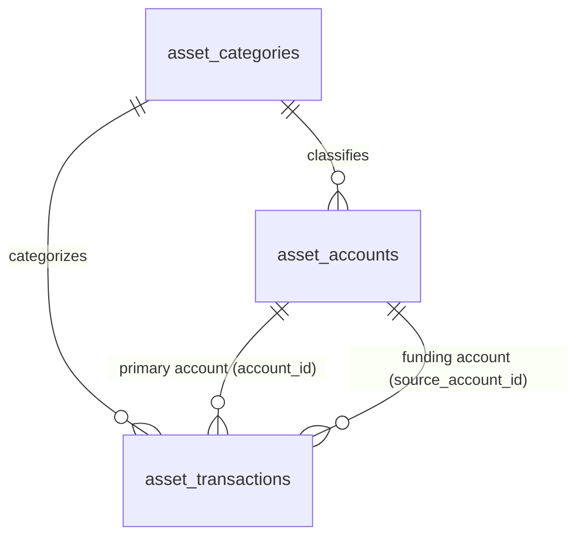

# Data Model: Asset and Income Dashboard Refinements

This document maps out the key database entities, relationships, validation constraints, and state transitions relevant to the refinements.

## Database Entities

### 1. `asset_categories` (Existing Table)
Represents functional classification of assets and spending/income.

| Column | Type | Constraints | Description |
| :--- | :--- | :--- | :--- |
| `id` | `UUID` | Primary Key | Unique identifier. |
| `user_id` | `UUID` | Foreign Key (`profiles.id`) | Owner of the category. |
| `name` | `VARCHAR` | Not Null | Name of category (e.g. "Vàng miếng", "Lương", "Ăn uống"). |
| `color` | `VARCHAR` | Not Null | Hex code representation. |
| `icon` | `VARCHAR` | Not Null | Lucide icon name. |
| `type` | `VARCHAR` | Not Null (Default `'asset'`) | `'asset'` (accounts), `'spending'` (expenses), `'income'` (income sources). |

### 2. `asset_accounts` (Existing Table)
Represents a specific asset, cash account, or bank account.

| Column | Type | Constraints | Description |
| :--- | :--- | :--- | :--- |
| `id` | `UUID` | Primary Key | Unique identifier. |
| `user_id` | `UUID` | Foreign Key (`profiles.id`) | Owner of the asset account. |
| `category_id` | `UUID` | Foreign Key (`asset_categories.id`) | Links to its category. |
| `name` | `VARCHAR` | Not Null | Name of the specific asset (e.g. "Vietcombank Cash", "SJC Gold"). |
| `quantity` | `NUMERIC` | Not Null (Default `0`) | Current holding quantity (balance or physical amount). |
| `unit_price` | `NUMERIC` | Not Null (Default `0`) | Current unit price in fiat. |
| `purchase_unit_price`| `NUMERIC` | Nullable | Cost price per unit when purchased. |
| `ticker` | `VARCHAR` | Nullable | Market price lookup ticker (e.g. `BTC-USD`, `HPG`). |
| `currency` | `VARCHAR` | Not Null (Default `'VND'`) | Primary currency (`'VND'` or `'USD'`). |
| `purchase_date` | `DATE` | Not Null | Ownership date. |

### 3. `asset_transactions` (Existing Table)
Represents a transaction event impacting an asset account balance or quantity.

| Column | Type | Constraints | Description |
| :--- | :--- | :--- | :--- |
| `id` | `UUID` | Primary Key | Unique identifier. |
| `user_id` | `UUID` | Foreign Key (`profiles.id`) | Transaction owner. |
| `account_id` | `UUID` | Foreign Key (`asset_accounts.id`) | Destination or primary asset account. |
| `source_account_id` | `UUID` | Foreign Key (`asset_accounts.id`) | Source funding account (for buy/sell/transfer). |
| `type` | `VARCHAR` | Not Null | `'income'` \| `'expense'` \| `'buy'` \| `'sell'` \| `'transfer'`. |
| `category_id` | `UUID` | Foreign Key (`asset_categories.id`) | Income/spending category reference. |
| `amount` | `NUMERIC` | Not Null (Default `0`) | Transaction value in fiat currency. |
| `quantity` | `NUMERIC` | Not Null (Default `0`) | Physical quantity transacted (calculated for non-cash assets). |
| `price_per_unit` | `NUMERIC` | Not Null (Default `0`) | Rate per unit at the time of transaction. |
| `currency` | `VARCHAR` | Not Null | Transaction currency matching the primary account. |
| `transaction_date` | `DATE` | Not Null | Date of transaction execution. |

## Relationships

## Validation & Business Rules

1. **Wallet vs Asset Definition**:
   - Accounts are identified as "wallets" if their category name contains cash-like terms (e.g. cash, bank, tiền mặt, ví, ngân hàng).
2. **Income Quantity Balance Adjustment**:
   - For wallet accounts (unit price is 1): `quantity += amount` (where amount is the income value).
   - For non-wallet assets (unit price > 1): `quantity += amount / unit_price`.
3. **Transaction record quantity mapping**:
   - For wallet accounts, `quantity` is saved as 1, and `price_per_unit` equals `amount`.
   - For non-wallet assets, `quantity` is saved as `amount / unit_price` (calculated), and `price_per_unit` is saved as the asset's current `unit_price`.
